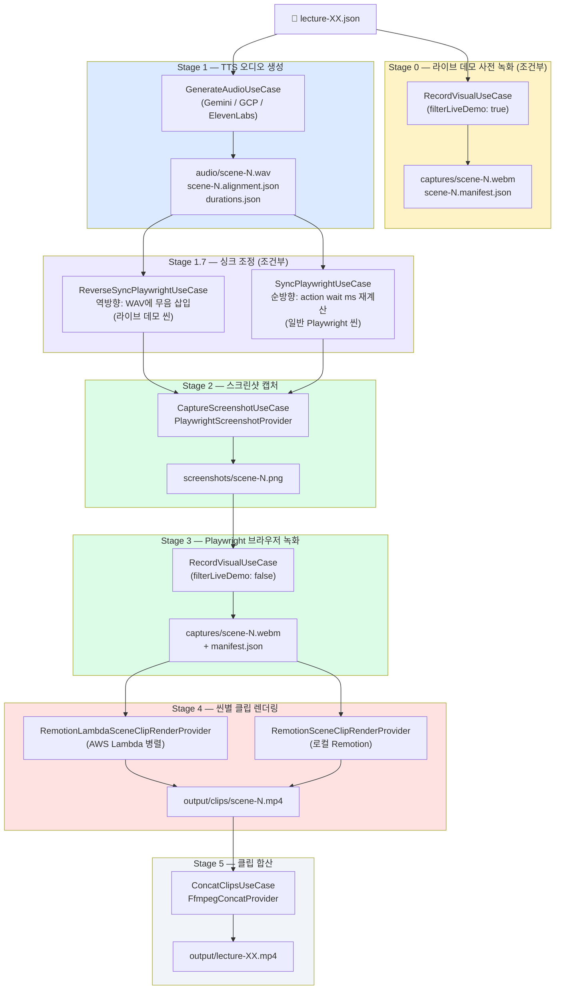
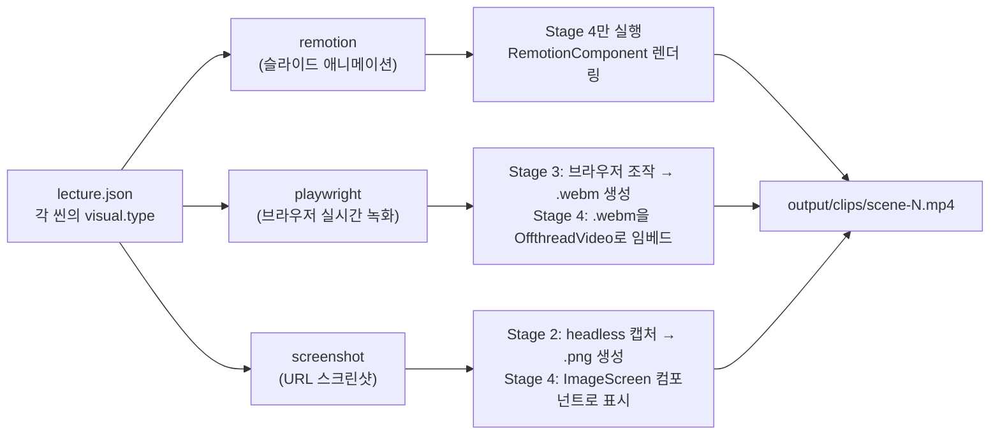
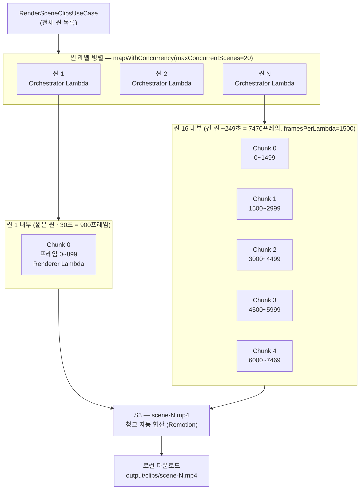
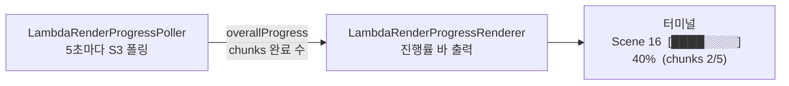
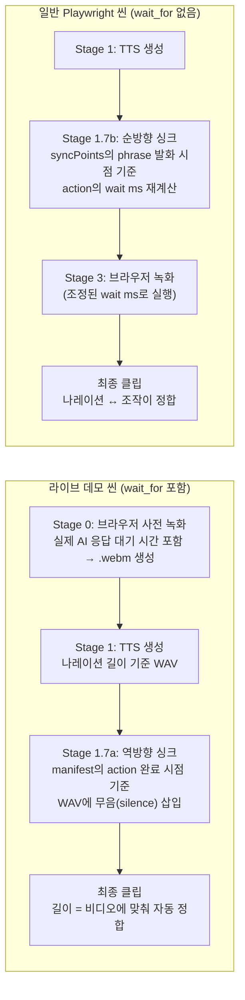

# パイプライン アーキテクチャ

강의 JSON 한 파일이 최종 MP4로 변환되기까지의 전체 구조를 정리한 문서.

---

## 전체 흐름 개요



---

## 시각 타입 3종 (visual type)

씬마다 `visual.type` 필드에 따라 처리 경로가 달라진다.



### 타입별 상세

| 항목 | `remotion` | `playwright` | `screenshot` |
|------|-----------|-------------|-------------|
| **Stage 2** | — | — | `.png` 캡처 |
| **Stage 3** | — | `.webm` + `.manifest.json` 생성 | — |
| **Stage 4 렌더링** | React 컴포넌트 직접 렌더 | `.webm`을 `OffthreadVideo`로 임베드 | `.png`를 `ImageScreen`으로 애니메이션 |
| **Sync 조정** | — | syncPoints 기반 싱크 (순방향/역방향) | — |

---

## AWS Lambda 병렬 렌더링 구조

Lambda 모드(`make run-lambda`)에서는 **씬 레벨**과 **청크 레벨** 두 계층으로 병렬화된다.



### Lambda 병렬화 파라미터

| 레벨 | 환경변수 | 기본값 | 설명 |
|------|----------|--------|------|
| **씬 레벨** | `REMOTION_LAMBDA_CONCURRENCY` | `20` | 동시에 실행되는 씬(오케스트레이터) 수 |
| **청크 레벨** | `REMOTION_LAMBDA_FRAMES_PER_LAMBDA` | `10000` | Lambda 1개가 처리하는 최대 프레임 수 |
| **탭 레벨** | `REMOTION_LAMBDA_TAB_CONCURRENCY` | 미설정 | Lambda 내부 병렬 브라우저 탭 수 |

#### 동시 실행 Lambda 수 계산

```
동시 Lambda 수 ≈ min(씬 수, maxConcurrentScenes) × ceil(씬 프레임 수 / framesPerLambda)
```

예시: 25씬 강의, 30fps 기준

| 씬 길이 | 프레임 수 | framesPerLambda=1500 기준 청크 수 |
|---------|-----------|----------------------------------|
| 15초 | 450 | 1개 |
| 60초 | 1800 | 2개 |
| 249초 | 7470 | **5개** |

#### 900초 타임아웃과 framesPerLambda 관계

AWS Lambda 최대 타임아웃은 **900초(15분)** 으로 고정 (증가 불가). 긴 씬이 단일 청크에 몰리면 타임아웃이 발생한다.

```
framesPerLambda=10000 (기본값)
  → 7470프레임 전부가 청크 1개에 할당
  → 900초 초과 → 타임아웃 ❌

framesPerLambda=1500 (권장값, .env에 설정)
  → 1500프레임 × 5청크로 분산
  → 청크당 ~530초 → 900초 이내 ✅
```

### Lambda 진행률 표시 구조

각 씬의 렌더링 진행 상태는 터미널에 인플레이스(in-place)로 갱신된다.



- **`LambdaRenderProgressPoller`**: `getRenderProgress()` API를 폴링, `overallProgress`(0~1) 수신
- **`LambdaRenderProgressRenderer`**: 씬별 막대바를 ANSI 이스케이프로 인플레이스 갱신. 동시 실행 중인 모든 씬을 한 화면에 표시

---

## Playwright 씬의 싱크 조정 구조

Playwright 씬은 **나레이션(TTS)** 과 **브라우저 조작(action)** 의 타이밍을 맞추는 싱크 단계가 있다. 씬 유형에 따라 방향이 다르다.



### syncPoints 구조

```json
"syncPoints": [
  { "actionIndex": 4, "phrase": "パネルを表示してみましょう" },
  { "actionIndex": 8, "phrase": "追ってみましょう" }
]
```

- `phrase`: 해당 action이 실행되어야 할 나레이션 구절 (부분 문자열)
- `actionIndex`: 그 시점에 실행할 `action` 배열의 인덱스 (0-based)
- 순방향 싱크는 TTS alignment 데이터로 phrase 발화 시점을 ms 단위로 추출한 뒤 선행 `wait` ms 값을 자동 재계산

---

## 캐싱 전략

각 단계의 산출물은 이미 존재하면 스킵된다. `FORCE=1` 또는 `--force` 옵션으로 강제 재생성.

| 산출물 | 경로 | 항상 재생성? |
|--------|------|-------------|
| TTS 오디오 | `packages/remotion/public/audio/{id}/scene-N.wav` | — |
| Playwright 녹화 | `packages/remotion/public/captures/{id}/scene-N.webm` | — |
| 스크린샷 | `packages/remotion/public/screenshots/{id}/scene-N.png` | — |
| 씬 클립 | `output/clips/{id}/scene-N.mp4` | — |
| 최종 MP4 | `output/{id}.mp4` | ✅ 항상 |

---

## Make 명령어 → 파이프라인 단계 매핑

| 명령어 | Stage 0 | Stage 1 | Stage 3 | Stage 4 | Stage 5 |
|--------|---------|---------|---------|---------|---------|
| `make run` | ✅ | ✅ | ✅ | 로컬 | ✅ |
| `make run-lambda` | ✅ | ✅ | ✅ | Lambda | ✅ |
| `make run-force-lambda` | ✅ | ✅ | ✅ | Lambda (강제) | ✅ |
| `make run-render-only-lambda` | — | — | — | Lambda | ✅ |
| `make regen-scene SCENE='11 12'` | — | — | — | Lambda (지정 씬) | ✅ |
| `make render-scene-lambda SCENE=16` | — | — | — | Lambda (지정 씬) | — |
| `make concat-scenes` | — | — | — | — | ✅ |

---

## 주요 파일 구조

```
packages/automation/src/
├── application/use-cases/
│   ├── RunAutomationPipelineUseCase.ts          # Stage 0~5 순차 실행 오케스트레이터
│   ├── GenerateAudioUseCase.ts                  # Stage 1: TTS (7초 스로틀링)
│   ├── ReverseSyncPlaywrightUseCase.ts          # Stage 1.7a: 역방향 싱크
│   ├── SyncPlaywrightUseCase.ts                 # Stage 1.7b: 순방향 싱크
│   ├── CaptureScreenshotUseCase.ts              # Stage 2: 스크린샷
│   ├── RecordVisualUseCase.ts                   # Stage 0, 3: Playwright 녹화
│   ├── RenderSceneClipsUseCase.ts               # Stage 4: 렌더링 디스패치 + 캐시
│   └── ConcatClipsUseCase.ts                    # Stage 5: concat
├── infrastructure/providers/
│   ├── PlaywrightScreenshotProvider.ts          # headless 스크린샷 캡처
│   ├── PlaywrightVisualProvider.ts              # 브라우저 녹화 (.webm + manifest)
│   ├── RemotionSceneClipRenderProvider.ts       # 로컬 렌더링 (child process)
│   ├── RemotionLambdaSceneClipRenderProvider.ts # Lambda 렌더링 (씬 레벨 병렬)
│   └── remotion-lambda/
│       ├── LambdaRenderConfigReader.ts          # 환경변수 → LambdaRenderConfig
│       ├── LambdaSceneRenderer.ts               # renderMediaOnLambda → poll → download
│       ├── LambdaRenderProgressPoller.ts        # S3 폴링 → overallProgress
│       ├── LambdaRenderProgressRenderer.ts      # 터미널 인플레이스 진행률 바
│       └── types.ts                             # LambdaRenderConfig 타입
└── infrastructure/utils/
    └── mapWithConcurrency.ts                    # 세마포어 기반 병렬 실행 유틸
```

---

## 환경변수 레퍼런스 (Lambda 렌더링)

| 환경변수 | 기본값 | 필수 | 설명 |
|----------|--------|------|------|
| `AWS_REGION` | `us-east-1` | ✅ | Lambda + S3 리전 |
| `REMOTION_LAMBDA_FUNCTION_NAME` | — | ✅ | Lambda 함수명 |
| `REMOTION_SERVE_URL` | — | — | S3 사이트 URL (미설정 시 자동 deploy) |
| `REMOTION_LAMBDA_CONCURRENCY` | `20` | — | 씬 레벨 최대 동시 실행 수 |
| `REMOTION_LAMBDA_FRAMES_PER_LAMBDA` | `10000` | — | 청크당 최대 프레임 수 (**긴 씬은 `1500` 권장**) |
| `REMOTION_LAMBDA_TAB_CONCURRENCY` | 미설정 | — | Lambda 내부 병렬 탭 수 |
| `REMOTION_LAMBDA_POLL_INTERVAL_MS` | `5000` | — | 완료 폴링 간격 (ms) |
| `REMOTION_LAMBDA_CLEANUP_ASSETS` | `1` | — | `0` 설정 시 S3 에셋 유지 |
| `REMOTION_LAMBDA_CLEANUP_RENDERS` | `1` | — | `0` 설정 시 S3 렌더 결과 유지 |
| `REMOTION_LAMBDA_PRIVACY` | `private` | — | S3 오브젝트 ACL |
| `REMOTION_LAMBDA_DEPLOY` | — | — | `1` 설정 시 Lambda 사이트 강제 재배포 |
