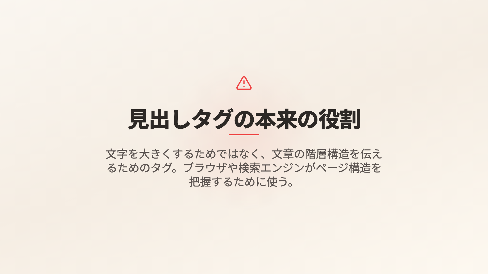
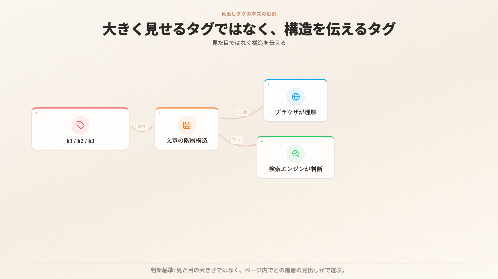
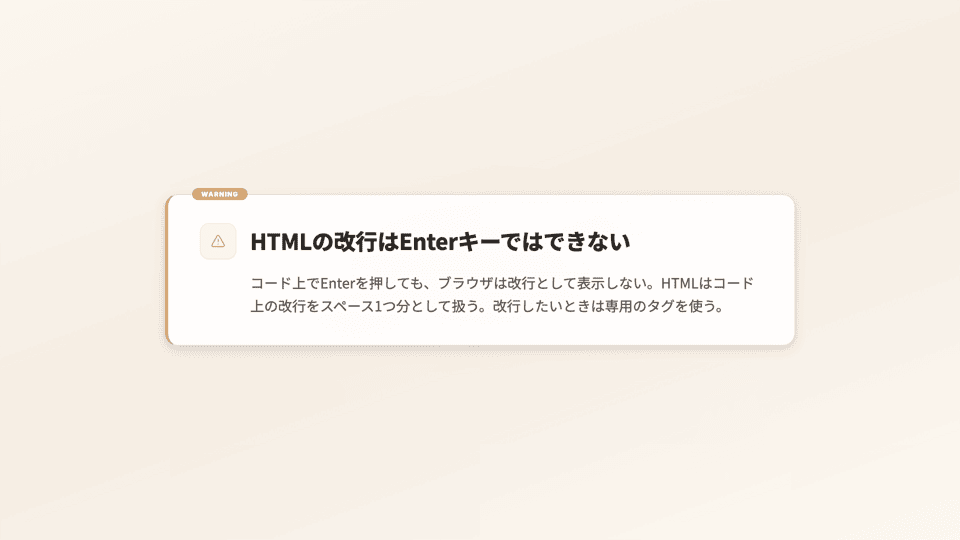
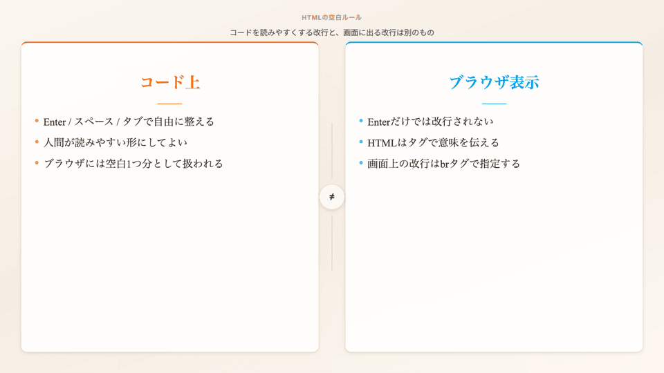
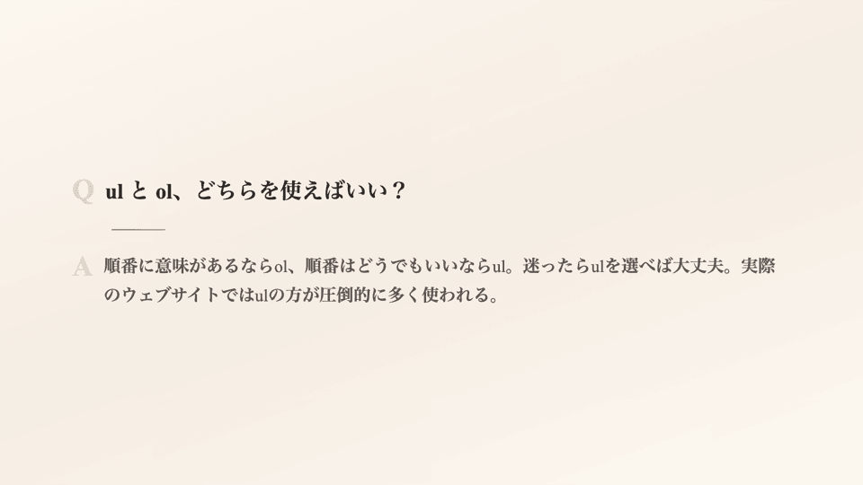
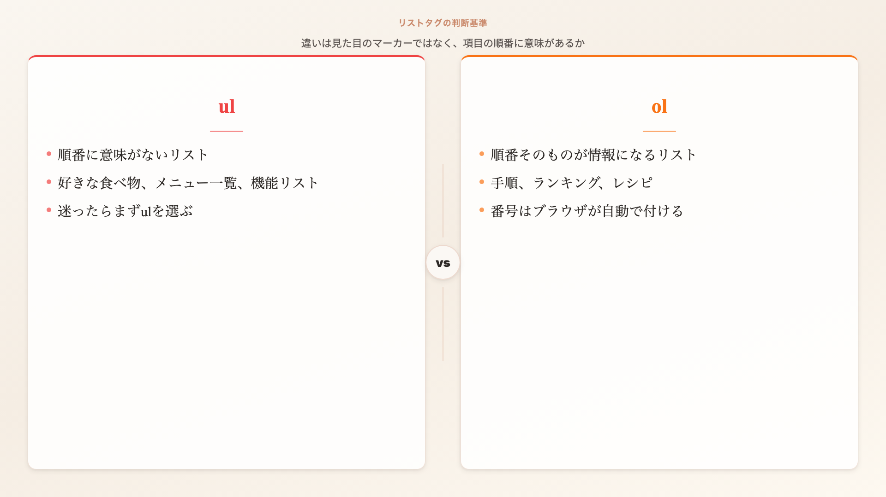

# JSON information density comparison

Related: #122, #123, #126, #127, #128

Initial date: 2026-04-27. Vertical slice sample 2 added on the same date.

## Scope

| Sample | Lecture | Purpose |
|---|---|---|
| 1 | `data/lecture-02-02.json` (テキストを扱うタグ) | Original #123 sample. Validates that `visual.props` preserves learning information structure rather than summarizing narration. |
| 2 | `data/lecture-02-03.json` (リンクと画像) | Vertical slice re-conversion. Verifies that the #123 / #128 policies hold on a second lecture with mixed gap types: lesson goal cards, conceptual network, metaphor pairing, industry use-case list, abbreviation pattern, next-lecture preview. |

Both samples follow the same constraint: narration text is not changed. Only Remotion `visual` choices and props were reconverted.

Committed still directories:

- Sample 1: `docs/assets/issue-123/`
- Sample 2: `docs/assets/issue-126/` (created on render)

Temporary render working directory used during review: `/tmp/review/issue-123-info-density` (sample 1), `/tmp/review/issue-126-info-density` (sample 2).

## Before / after stills

| Scene | Before still | After still | Reference comparison target |
|---:|---|---|---|
| 6 | `docs/assets/issue-123/before-scene-6.png` | `docs/assets/issue-123/after-scene-6.png` | MDN heading usage notes: heading levels, no text-resize misuse, no skipped levels |
| 10 | `docs/assets/issue-123/before-scene-10.png` | `docs/assets/issue-123/after-scene-10.png` | MDN whitespace handling: code readability whitespace vs browser whitespace processing |
| 17 | `docs/assets/issue-123/before-scene-17.png` | `docs/assets/issue-123/after-scene-17.png` | MDN list usage notes: order meaningful → `ol`, otherwise `ul` |

### Scene 6

| Before | After |
|---|---|
|  |  |

### Scene 10

| Before | After |
|---|---|
|  |  |

### Scene 17

| Before | After |
|---|---|
|  |  |

## External reference sources

Third-party screenshots are not committed in this repository. Instead, this sheet keeps stable reference URLs and compares against the information structures visible in those public references.

| Scene | Reference source | Structure used as comparison target |
|---:|---|---|
| 6 | MDN [`<h1>-<h6>` heading elements](https://developer.mozilla.org/en-US/docs/Web/HTML/Reference/Elements/Heading_Elements) | six heading levels, page hierarchy, accessibility/navigation, "do not use headings to resize text" |
| 10 | MDN [Handling whitespace](https://developer.mozilla.org/en-US/docs/Web/CSS/CSS_text/Whitespace) | whitespace characters used for code readability vs processing in rendered output |
| 17 | MDN [`<ol>` element](https://developer.mozilla.org/en-US/docs/Web/HTML/Reference/Elements/ol), MDN [`<ul>` element](https://developer.mozilla.org/en-US/docs/Web/HTML/Element/ul) | ordered list meaning, unordered list meaning, reorder test for choosing `ol` vs `ul` |

## Scene decisions

| Scene | Before | After | Information units retained after reconversion |
|---:|---|---|---|
| 6 | `KeyPointScreen` | `DiagramScreen` | heading tag examples, document hierarchy, browser interpretation, search engine interpretation, usage criterion |
| 10 | `CalloutScreen` | `ComparisonScreen` | code-side whitespace, human readability, browser rendering behavior, tag-based line break rule, `br` bridge |
| 17 | `QnAScreen` | `ComparisonScreen` | `ul` use cases, `ol` use cases, marker behavior, order-as-information criterion, default choice when unsure |

## #123 criteria check

Information unit scoring follows `docs/json-conversion-rules.md`: independent nodes/cards/points count as 1 unit; relationship labels and short captions count only when they add a distinct relation or take-away.

| Scene | Narration core units | Still-recoverable units | Recovery |
|---:|---:|---:|---:|
| 6 | 6 | 5 | 83% |
| 10 | 5 | 5 | 100% |
| 17 | 6 | 5 | 83% |

| Criterion | Result |
|---|---|
| Audio dependency | Pass. All changed scenes exceed the 70% still-recovery threshold. |
| Simultaneous information units | Pass. All three changed scenes retain at least 5 still-recoverable information units. |
| Narration-screen complement | Pass. The screen turns sequential narration into a relationship diagram or decision comparison instead of repeating the conclusion sentence. |
| Short-slide exception | Pass. None of the three sampled scenes qualified for a short-slide exception because each narration contained multiple concepts and practical criteria. |
| Reference comparison | Partial but documented. Project stills are committed; external reference screenshots are not committed, but stable MDN URLs and comparison structures are recorded above. |

## Component boundary notes

No new component was required for these samples. Existing `DiagramScreen` and `ComparisonScreen` were sufficient for the selected information structures.

Keep the following as #127 territory when they appear in future conversions:

- code line ↔ rendered result mapping
- HTML tree ↔ page region mapping
- Flexbox axis / wrap / distribution diagrams
- selector ↔ DOM match visualization

Until those components are active, lecture JSON must continue to use existing components and record the missing structure as a follow-up instead of using candidate component names.

## Verification

- `jq empty data/lecture-02-02.json`
- `npx tsx packages/automation/src/presentation/cli/validate-lecture-schema.ts lecture-02-02.json --strict`
- `npx remotion compositions src/PreviewRoot.tsx`
- Rendered before/after stills for scenes 6, 10, and 17.

Still reproduction commands:

```bash
mkdir -p /tmp/review/issue-123-info-density
git show 0b9da9c:data/lecture-02-02.json > /tmp/review/issue-123-info-density/lecture-02-02-before.json
jq -n --slurpfile lecture /tmp/review/issue-123-info-density/lecture-02-02-before.json '{lectureData:$lecture[0],sceneId:6,durationInFrames:120}' > /tmp/review/issue-123-info-density/before-scene-6-props.json
npx remotion still src/PreviewRoot.tsx PreviewScene /tmp/review/issue-123-info-density/before-scene-6.png --frame=60 --props=/tmp/review/issue-123-info-density/before-scene-6-props.json
```

`0b9da9c` is the PR base commit used for the before JSON. Each future comparison should record its own PR base SHA or base branch HEAD point the same way. Use the same pattern with `sceneId` 10 and 17 for before stills, and `data/lecture-02-02.json` for after stills. The committed PNGs in `docs/assets/issue-123/` are the canonical comparison artifacts for this PR.

Committed stills were downscaled to 960x540 and compressed in one batch with `pngquant --quality=70-90` to keep comparison assets small enough for git history.

---

## Sample 2: lecture-02-03 — Vertical slice (re-conversion)

Six scenes were re-converted to validate the #123 information density policy and #128 visual style preset opt-in on a second lecture. Scenes were chosen because narration carried structured content (multi-item goals, network, metaphor pair, multi-industry list, abbreviation pattern, next-preview contrast) that the original single-message slides did not preserve.

### Before / after stills

Stills are rendered separately when the user runs the pipeline. Until rendered, paths below are forward declarations. Final committed PNGs live in `docs/assets/issue-126/`.

| Scene | Before still | After still | Reference comparison target |
|---:|---|---|---|
| 3 | `docs/assets/issue-126/before-scene-3.png` | `docs/assets/issue-126/after-scene-3.png` | NotebookLM / Progate lesson outcome cards: 2〜3 deliverables with icon + short detail |
| 5 | `docs/assets/issue-126/before-scene-5.png` | `docs/assets/issue-126/after-scene-5.png` | MDN [How the Web works](https://developer.mozilla.org/en-US/docs/Learn/Common_questions/Web_mechanics/How_does_the_Internet_work): client-server-page network diagram |
| 7 | `docs/assets/issue-126/before-scene-7.png` | `docs/assets/issue-126/after-scene-7.png` | MDN [`<a>` element](https://developer.mozilla.org/en-US/docs/Web/HTML/Reference/Elements/a): anchor element semantics and naming |
| 23 | `docs/assets/issue-126/before-scene-23.png` | `docs/assets/issue-126/after-scene-23.png` | MDN [Images in HTML](https://developer.mozilla.org/en-US/docs/Learn/HTML/Multimedia_and_embedding/Images_in_HTML): why images matter on a web page |
| 24 | `docs/assets/issue-126/before-scene-24.png` | `docs/assets/issue-126/after-scene-24.png` | MDN [HTML elements reference](https://developer.mozilla.org/en-US/docs/Web/HTML/Reference/Elements): per-element abbreviation origin |
| 56 | `docs/assets/issue-126/before-scene-56.png` | `docs/assets/issue-126/after-scene-56.png` | MDN [Document and website structure](https://developer.mozilla.org/en-US/docs/Learn/HTML/Introduction_to_HTML/Document_and_website_structure): semantic regions vs flat tag list |

### Scene decisions

| Scene | Before | After | Style preset | Information units retained after reconversion |
|---:|---|---|---|---|
| 3 | `KeyPointScreen` | `BulletDetailScreen` | `concept-calm` | 3 lesson goals (写真, SNSリンク, ウェブサイトらしい見た目) each with icon + role detail |
| 5 | `QuoteScreen` | `DiagramScreen` | `concept-calm` | 4 page nodes (ニュース・ショップ・ブログ・動画), 6 link edges, WWW take-away in title, URL手入力 counter-example in caption |
| 7 | `DefinitionScreen` | `TwoColumnScreen` | `concept-calm` | 船の錨 metaphor column, aタグ concrete column with code shape, "Anchor 頭文字" anchored as title |
| 23 | `KeyPointScreen` | `IconListScreen` | `concept-calm` | 3 industry use cases (美容室・カフェ・教室) with the photo subject each industry needs |
| 24 | `DefinitionScreen` | `BulletDetailScreen` | `concept-calm` | abbreviation pattern as title + 3 instances (img→Image, a→Anchor, p→Paragraph) |
| 56 | `KeyPointScreen` | `ComparisonScreen` | `recap-synthesis` | 現在 column (h1/p/ul/img/a, 順に並ぶ, まとまり見えない), 次回 column (ヘッダー/メイン/フッター, 区分け, AI読みやすい), structural shift in subtitle |

### #123 criteria check

| Scene | Narration core units | Still-recoverable units | Recovery |
|---:|---:|---:|---:|
| 3 | 3 (3 goals) | 3 | 100% |
| 5 | 4 (network, WWW meaning, link role, no-link counter-example) | 4 | 100% |
| 7 | 4 (aタグ, Anchor 略, 錨 metaphor, ページ接続役割) | 4 | 100% |
| 23 | 5 (1 general + 3 industry examples + 1 take-away) | 4 | 80% |
| 24 | 5 (imgタグ + 略パターン + 3 examples + 推測しやすい insight) | 4 | 80% |
| 56 | 5 (next topic, 現状, 次回構造, 見た目変わらず, AI読みやすい) | 5 | 100% |

| Criterion | Result |
|---|---|
| Audio dependency | Pass. All six scenes meet or exceed the 70% still-recovery threshold. |
| Simultaneous information units | Pass. Every scene retains at least 4 still-recoverable information units. |
| Visual hierarchy | Pass. Headline/title plus 3〜4 sub-items keep one focal anchor per scene. |
| Reference comparison | Documented. External reference URLs listed above; project stills will be committed after render. |
| Narration-screen complement | Pass. Each after-slide encodes a relationship (network, before/after, metaphor pairing, abbreviation table) instead of repeating a single narration sentence. |

### Component boundary notes

No #127 candidate component was required. The six scenes fit existing components:

- Goal cards → `BulletDetailScreen`
- Network → `DiagramScreen`
- Metaphor pairing → `TwoColumnScreen`
- Use-case list → `IconListScreen`
- Abbreviation pattern → `BulletDetailScreen`
- Structural progression → `ComparisonScreen`

If subsequent lectures introduce code↔result mapping, HTML tree↔region mapping, Flexbox layouts, or selector matching, fall back to the closest current component and record the gap as #127 follow-up. Do not write candidate component names into lecture JSON.

### Verification

- `jq empty data/lecture-02-03.json`
- `make lint-fix LECTURE=lecture-02-03.json`
- `make lint LECTURE=lecture-02-03.json STRICT=1`
- Render before/after stills for scenes 3, 5, 7, 23, 24, 56 and commit downscaled PNGs into `docs/assets/issue-126/`.

### Still reproduction commands

The "before" JSON is the state of `data/lecture-02-03.json` at the base commit `e8a88f2` (origin/main HEAD when this branch was cut).

```bash
mkdir -p /tmp/review/issue-126-info-density
git show e8a88f2:data/lecture-02-03.json > /tmp/review/issue-126-info-density/lecture-02-03-before.json

# Before still example for scene 3
jq -n --slurpfile lecture /tmp/review/issue-126-info-density/lecture-02-03-before.json \
  '{lectureData:$lecture[0],sceneId:3,durationInFrames:120}' \
  > /tmp/review/issue-126-info-density/before-scene-3-props.json
npx remotion still src/PreviewRoot.tsx PreviewScene \
  /tmp/review/issue-126-info-density/before-scene-3.png --frame=60 \
  --props=/tmp/review/issue-126-info-density/before-scene-3-props.json

# After still example for scene 3
jq -n --slurpfile lecture data/lecture-02-03.json \
  '{lectureData:$lecture[0],sceneId:3,durationInFrames:120}' \
  > /tmp/review/issue-126-info-density/after-scene-3-props.json
npx remotion still src/PreviewRoot.tsx PreviewScene \
  /tmp/review/issue-126-info-density/after-scene-3.png --frame=60 \
  --props=/tmp/review/issue-126-info-density/after-scene-3-props.json
```

Repeat the same pattern with `sceneId` 5, 7, 23, 24, and 56. Downscale to 960x540 and compress with `pngquant --quality=70-90` before committing into `docs/assets/issue-126/`.
